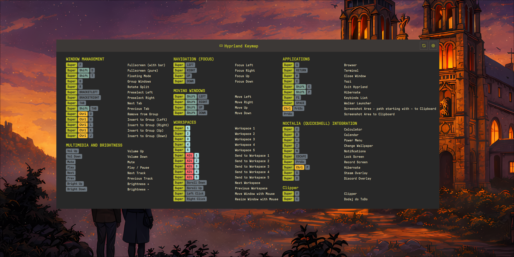

# Keybind Cheatsheet for Noctalia

Universal keyboard shortcuts cheatsheet plugin for Noctalia that **automatically detects** your compositor (Hyprland or Niri) and displays your keybindings with **recursive config parsing**.



## Features

- **Automatic compositor detection** (Hyprland or Niri)
- **Recursive config parsing** - follows all `source` (Hyprland) and `include` (Niri) directives
- **Glob pattern support** - parses `~/.config/hypr/*.conf` style includes
- **Configurable paths** - set custom config file locations in settings
- **Smart key formatting** - XF86 keys display as readable names (Vol Up, Bright Down, etc.)
- **Color-coded modifier keys** (Super, Ctrl, Shift, Alt)
- **Flexible column layout** (1-4 columns)
- **Auto-height** - adjusts to content automatically
- **IPC support** - global hotkey toggle

## Supported Compositors

| Compositor | Default Config | Format |
|------------|----------------|--------|
| **Hyprland** | `~/.config/hypr/hyprland.conf` | Hyprland config format |
| **Niri** | `~/.config/niri/config.kdl` | KDL format |

## Installation

```bash
cp -r keybind-cheatsheet ~/.config/noctalia/plugins/
```

## Usage

### Bar Widget
Add the plugin to your bar configuration in Noctalia settings. Click the keyboard icon to open the cheatsheet.

### Global Hotkey

#### Hyprland
Add to your config:
```bash
bind = $mod, F1, exec, qs -c noctalia-shell ipc call plugin:keybind-cheatsheet toggle
```
You can specify your custom Super key variable (e.g., $mainMod) in the plugin settings.

#### Niri
Add to your config:
```kdl
binds {
    Mod+F1 { spawn "qs -c noctalia-shell ipc call plugin:keybind-cheatsheet toggle"; }
}
```

## Config Format

### Hyprland

The plugin recursively parses your main config and all `source` includes.

**Keybind format:**
```bash
# 1. APPLICATIONS
bind = $mainMod, T, exec, alacritty #"Terminal"
bind = $mainMod, B, exec, firefox #"Browser"

# 2. WINDOW MANAGEMENT
bind = $mainMod, Q, killactive, #"Close window"
bind = $mainMod, F, fullscreen, #"Toggle fullscreen"

# 3. WORKSPACES
bind = $mainMod, 1, workspace, 1 #"Workspace 1"
bind = $mainMod SHIFT, 1, movetoworkspace, 1 #"Move to workspace 1"
```

**Requirements:**
- Categories: `# N. CATEGORY NAME` (where N is a number)
- Descriptions: `#"description"` at end of bind line
- Modifiers: `$mod`, `SHIFT`, `CTRL`, `ALT`

**Source directives (automatically followed):**
```bash
source = ~/.config/hypr/keybinds.conf
source = ~/.config/hypr/apps/*.conf
```

### Niri

The plugin parses the `binds { }` block and follows all `include` directives.

**Keybind format:**
```kdl
binds {
    // #"Applications"
    Mod+T hotkey-overlay-title="Terminal" { spawn "alacritty"; }
    Mod+B hotkey-overlay-title="Browser" { spawn "firefox"; }

    // #"Window Management"
    Mod+Q hotkey-overlay-title="Close window" { close-window; }
    Mod+F hotkey-overlay-title="Fullscreen" { fullscreen-window; }

    // #"Workspaces"
    Mod+1 { focus-workspace 1; }
    Mod+2 { focus-workspace 2; }
}
```

**Requirements:**
- Categories: `// #"Category Name"` (must use this exact format)
- Descriptions: `hotkey-overlay-title="description"` attribute
- Without descriptions, actions are auto-categorized by type

**Include directives (automatically followed):**
```kdl
include "~/.config/niri/binds.kdl"
```

## Auto-Categorization (Niri)

When no category comment is provided, keybindings are grouped by action:

| Action prefix | Category |
|---------------|----------|
| `spawn` | Applications |
| `focus-column-*` | Column Navigation |
| `focus-window-*` | Window Focus |
| `focus-workspace-*` | Workspace Navigation |
| `move-column-*` | Move Columns |
| `move-window-*` | Move Windows |
| `close-window`, `fullscreen-window` | Window Management |
| `maximize-column` | Column Management |
| `set-column-width` | Column Width |
| `screenshot*` | Screenshots |
| `power-off-monitors` | Power |
| `quit` | System |

## Special Key Formatting

XF86 and other special keys are automatically formatted:

| Raw Key | Display |
|---------|---------|
| `XF86AudioRaiseVolume` | Vol Up |
| `XF86AudioLowerVolume` | Vol Down |
| `XF86AudioMute` | Mute |
| `XF86MonBrightnessUp` | Bright Up |
| `XF86MonBrightnessDown` | Bright Down |
| `Print` | PrtSc |
| `Prior` / `Next` | PgUp / PgDn |

## Settings

Access settings via the gear icon in the panel header:

- **Window width** - 400-3000px
- **Height** - Auto or manual (300-2000px)
- **Columns** - 1-4 columns
- **Config paths** - Custom paths for Hyprland/Niri configs
- **Refresh** - Force reload keybindings

## Troubleshooting

### "Loading..." stays forever

1. Check compositor is detected: look for logs with `[KeybindCheatsheet]`
2. Verify config file exists at the configured path
3. Ensure keybinds have proper format with descriptions

### No categories found

**Hyprland:** Categories must start with `# 1.`, `# 2.`, etc.

**Niri:** Use `// #"Category Name"` format for custom categories.

### Keybinds from included files not showing

The plugin follows `source` (Hyprland) and `include` (Niri) directives automatically. Check logs to see which files are being parsed.

## Requirements

- Noctalia Shell 4.1.0+
- Hyprland or Niri compositor

## License

MIT
