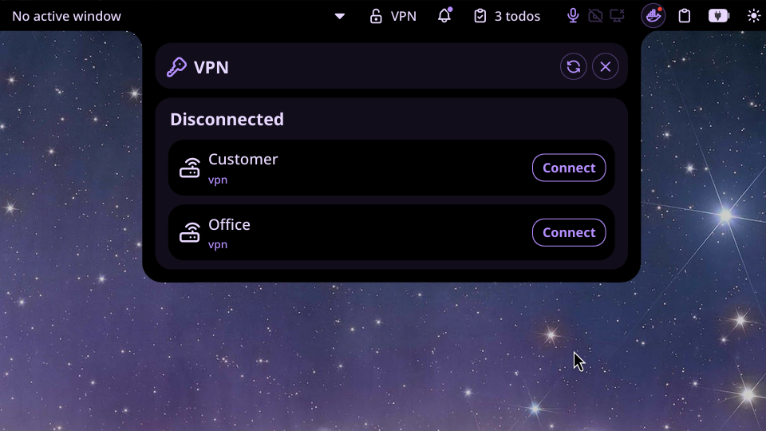

# Network Manager VPN

Plugin to connect to your VPN connections from the bar and Control Center. Supports OpenVPN and WireGuard connections managed by NetworkManager. Editing and creation are achieved using
nm-connection-editor

## Usage

Install the plugin and add it to your bar:

- **Bar widget** — A shield icon that shows if there is an active connection. Click it to open the VPN panel.
- **VPN panel** — Lists all configured VPN connections.

The panel refreshes automatically every 5 seconds. You can also trigger a manual refresh with the refresh button.

## Requirements

- **Noctalia Shell** ≥ 3.6.0
- **NetworkManager** with `nmcli`
- **nm-connection-editor** to edit and create connections